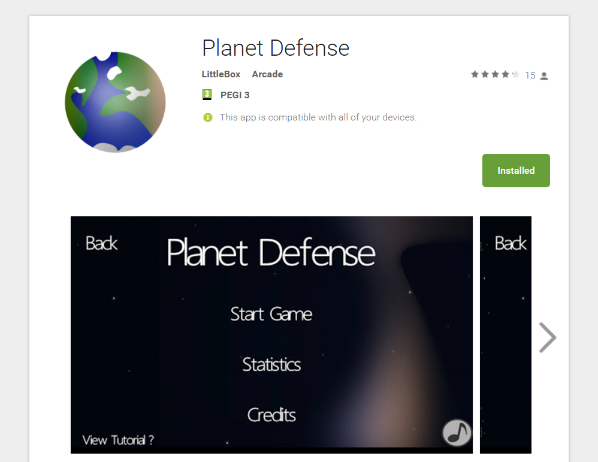

# Planet Defense

Planet Defense is a simple action game for wave based survival game fans. It is an OpenGL ES 2.0 application. In fact the whole thing is OpenGL apart from the message boxes which are of course native GUI items. It was built as I was getting into Android development for the first time and to this day I am still quite proud of it as I only have a year of programming expierence when I built this application.

## Overview

The application was built with Java and the Android-SDK using the OpenGL 2.0 ES bindings that are available in Android devices above 2.3.3 (Gingerbread). The artwork was built by a friend in the USA who did a brilliant job making the game as good as it could be. The game uses advanced OpenGL ES features such as particle systems and bitmap fonts.

## Features

* Hardware accelerated graphics
* Particle effects
* Basic 2D physics
* Bitmap fonts
 
## Links

[Google Play Store](https://play.google.com/store/apps/details?id=com.planetDefense&hl=en_GB)

## License
 
Apache 2.0
